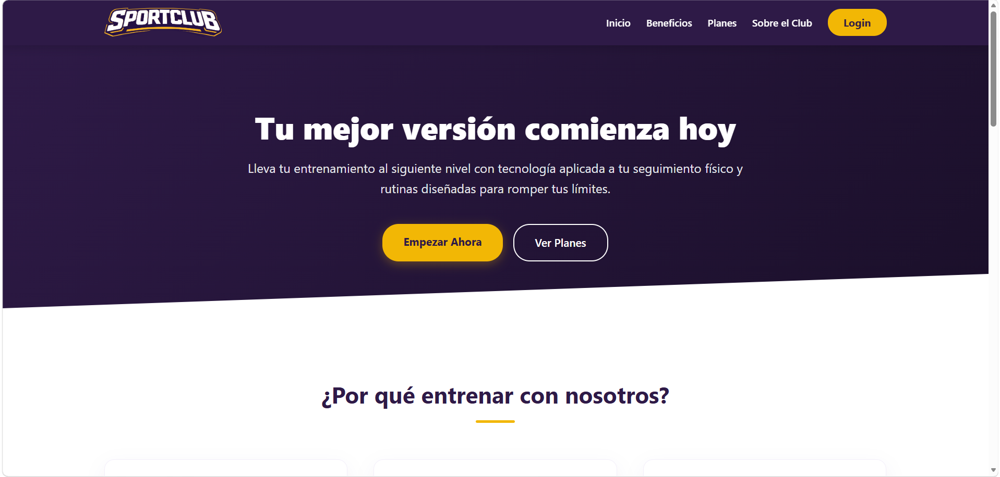
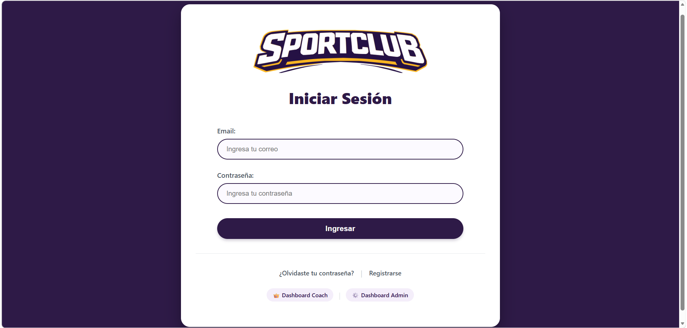
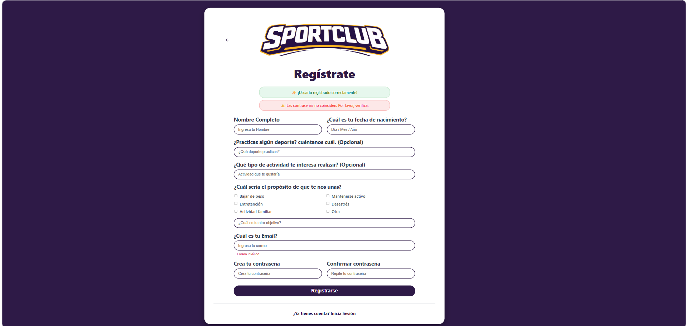
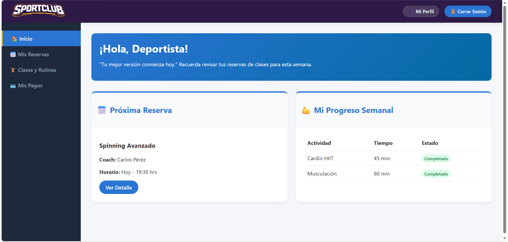
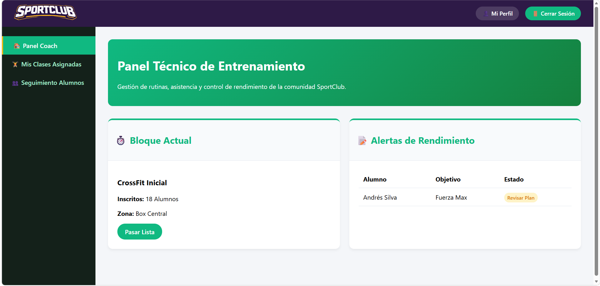
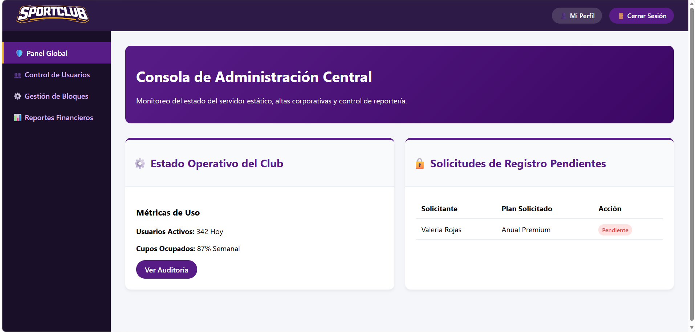

# 🏋️‍♂️ SportClub - Sistema de Gestión Deportiva Integral

**SportClub** es una plataforma web moderna y tecnológica orientada a la digitalización de procesos internos para centros de acondicionamiento físico. El sistema centraliza la experiencia de la comunidad deportiva a través de interfaces personalizadas y optimizadas para diferentes roles de usuario, conectadas en tiempo real a un backend propio mediante **consumo de API REST**.

🚀 **[VER APLICACIÓN EN VIVO]**(https://visnupriyaamstein.github.io/FrontEnd-SportClub-VAmstein/auth/landingPage.html)



---

## 📸 Capturas de Pantalla

### 🔑 Módulo de Autenticación (Login & Registro)
Login y registro consumen `/api/auth/login` y `/api/auth/register` respectivamente, con validación de formulario (campos obligatorios, formato de email, contraseña mínima de 8 caracteres + confirmación) y mensajes de error en pantalla, sin uso de `alert()`. Tras el login, la redirección es automática según el rol del usuario (admin, coach o user).

| Inicio de Sesión | Registro de Usuario |
| :---: | :---: |
|  |  |

### 📊 Paneles de Control (Dashboards por Rol)
Cada entorno cuenta con una identidad cromática propia y componentes semánticos independientes adaptados a su flujo operativo. El acceso a cada panel está protegido por `auth-guard.js`, que verifica token y rol antes de permitir el ingreso.

#### 1. Panel de Usuario (Identidad Azul)
*Seguimiento personal, próximas clases, progreso semanal y acceso a Mi Perfil.*
> 

#### 2. Panel Técnico de Coach (Identidad Verde)
*Monitoreo de bloques actuales, asistencia de alumnos y horarios asignados.*
> 

#### 3. Consola de Administración Central (Identidad Morada)
*Gestión de usuarios (CRUD completo) y estado operativo global.*
> 

### 👤 Módulo de Perfil (Unificado)
Un único modal de perfil, reutilizado en las tres vistas (`modal-perfil.js`), que consume `GET /api/auth/me` para mostrar los datos del usuario logueado y `PUT /api/auth/me` / `PUT /api/auth/me/password` para editar nombre, fecha de nacimiento y contraseña. El **email y el rol no son editables** por el propio usuario, según lo definido en la pauta del proyecto.

### 🧑‍💼 Módulo CRUD de Usuarios (Solo Admin)
Listado de usuarios consumido desde `GET /api/users`, con creación (`POST`), edición (`PUT`) y eliminación (`DELETE`) completas. Incluye asignación de rol mediante `select`, badges de color por rol (admin / coach / user), formato de fecha `dd/mm/yyyy` y validaciones visuales con mensajes bajo cada input.

---

## 🛠️ Tecnologías y Estándares Aplicados

- **HTML5 Semántico:** Estructura limpia y optimizada utilizando componentes nativos (`<header>`, `<nav>`, `<main>`, `<section>`, `<article>`) para eliminar el uso excesivo de contenedores genéricos.
- **CSS Personalizado:** Estilizado modular que implementa la paleta de colores corporativa (Morado Oscuro `#2E1A47`, Amarillo Dorado `#F2B705`, Blanco `#FFFFFF`) complementada con variables armónicas para los estados e identidades de cada rol.
- **JavaScript + Fetch API:** Consumo asíncrono de todos los endpoints del backend (`auth` y `users`), con manejo de token Bearer, normalización de respuestas y manejo de errores en pantalla.
- **Diseño Responsive:** Interfaces adaptables que resguardan la simetría visual y la experiencia de usuario en múltiples resoluciones de pantalla.

---

## 🔌 Endpoints Consumidos

| Módulo | Método | Ruta                       | Uso en el FrontEnd                  |
|--------|--------|-----------------------------|--------------------------------------|
| Auth   | POST   | `/api/auth/login`           | Inicio de sesión                     |
| Auth   | POST   | `/api/auth/register`        | Registro de nuevos usuarios (`user`) |
| Auth   | GET    | `/api/auth/me`               | Cargar datos del perfil propio       |
| Auth   | PUT    | `/api/auth/me`               | Editar nombre y fecha de nacimiento  |
| Auth   | PUT    | `/api/auth/me/password`      | Cambiar contraseña                   |
| Users  | GET    | `/api/users`                 | Listado de usuarios (Admin)          |
| Users  | POST   | `/api/users`                 | Crear usuario (Admin)                |
| Users  | PUT    | `/api/users/:id`              | Editar usuario (Admin)               |
| Users  | DELETE | `/api/users/:id`              | Eliminar usuario (Admin)             |

---

## 📁 Estructura del Proyecto

El repositorio mantiene la organización sugerida para asegurar la escalabilidad y el orden del código fuente:

```text
├── assets/          # Logos, imágenes y recursos visuales corporativos
├── auth/            # Vistas funcionales de los dashboards y módulos secundarios
├── css/             # Hojas de estilo unificadas y segregadas por interfaz
├── js/              # Lógica de cada módulo (auth, CRUD, perfil compartido)
├── index.html       # Punto de entrada principal que conecta directamente al Landing Page
├── ia.md            # Documentación de utilización de Inteligencia Artificial
└── README.md        # Documentación general del sistema
```

---
> 🎓 **Créditos:** Proyecto creado por Visnupriya Amstein para la clase de FrontEnd en INACAP 2026.
